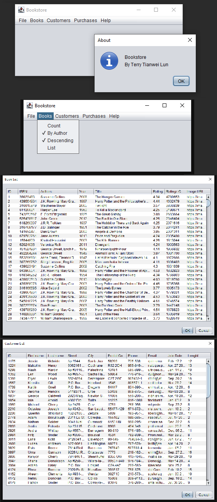

# Bookstore Management System
This is a personal course project for COMP 2613 (Java Application Development)

## Description
<ul>
<li>Java application with GUI utilized object-oriented design principles.</li>
<li>Read local file, parse and process raw data, store data to SQL database.</li>
<li>Extract data from database, process data, then display in GUI.</li>
</ul>

## Tech used:
<ul>
<li>Java</li>
<li>Object Oriented Design</li>
<li>MVC</li>
<li>JUnit</li>
<li>SQL</li>
<li>Swing</li>
<li>Apache Log4j</li>
</ul>

## Design pattern used:
<ul>
<li>Builder</li>
<li>Singleton</li>
</ul>

## Screenshots
